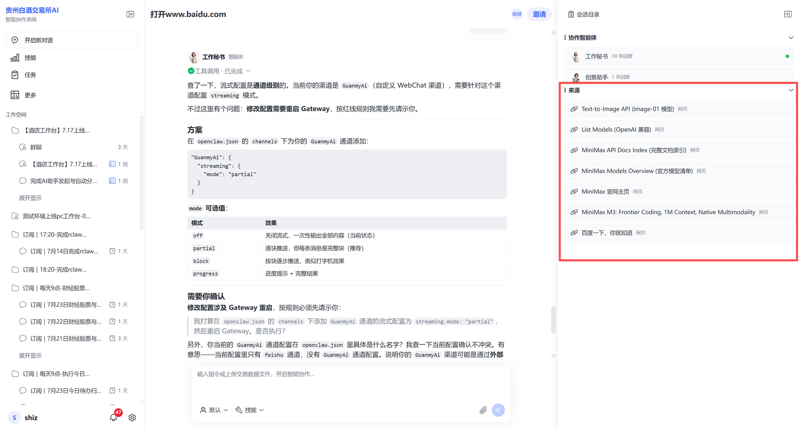
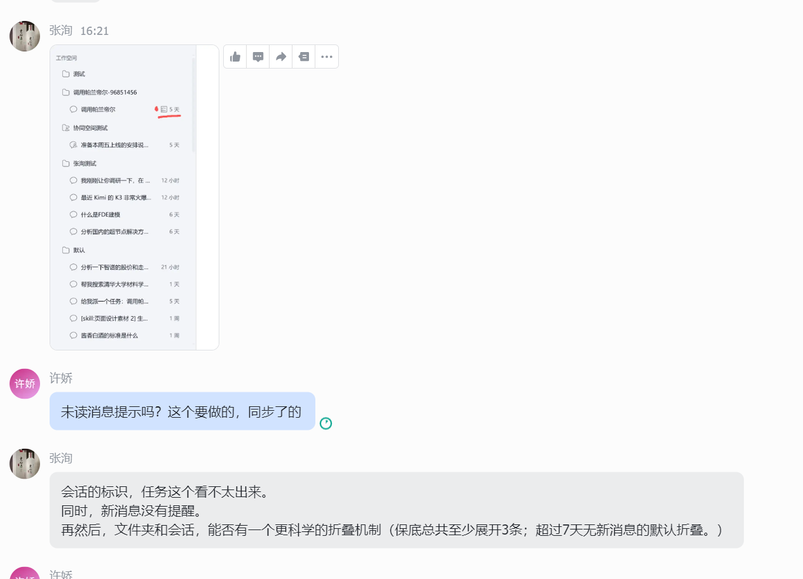

# 会话模块问题与需求记录

记录时间：2026-07-24

---

## 1. 测试记录中的会话与协同问题

- 来源：[测试记录 - 飞书 Wiki](https://jiujiaosuo.feishu.cn/wiki/WPijw06QwiSiOmkdyGGcXmphnCP?from=from_copylink)
- 说明：该测试记录中有些内容属于会话和协同的问题，刚和展哥他们过了一遍，需要后续一起考虑。

---

## 2. 右侧面板「来源」支持优化

- 当前状态：右侧面板已支持「来源」展示（见图一）。
- 待确认：是否需要进一步优化。

---

## 3. 输入框 AI 参与需求

- 来源：飞书分享【输入框AI参与需求7月9月】
- 链接：https://jiujiaosuo.feishu.cn/wiki/Mpzsw7LqJits2Lkg4ZEcefDynbh

---

## 4. 会话功能现状与待完善项

### 已具备功能

- 基本对话
- 历史会话
- 文件夹管理
- 角色与技能选择
- 文件上传

### 仍在完善的功能

- 会话重命名
- 文件夹折叠机制
- 会话侧边栏的 UI 效果优化
- 协同会话时文件夹的共享逻辑

> 负责人：彭爱玉、陈冰

---

## 5. 会话折叠问题（图二）

### 问题总结

根据图二中的反馈，当前会话折叠存在以下问题：

1. **会话/任务标识不清晰**
   从外观上难以区分普通会话与任务会话，任务标识不够明显。

2. **新消息缺少提醒**
   收到新消息后没有明显的提醒提示。

3. **折叠机制不够科学**
   建议优化折叠规则：
   - 保底总共至少展开 3 条会话/文件夹；
   - 超过 7 天无新消息的会话/文件夹，默认折叠。

